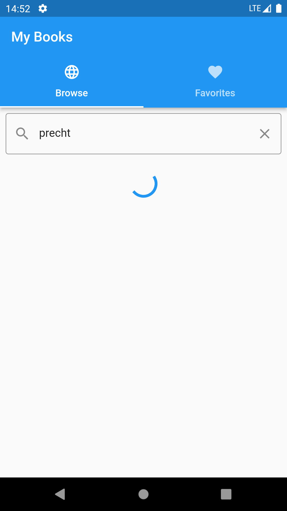
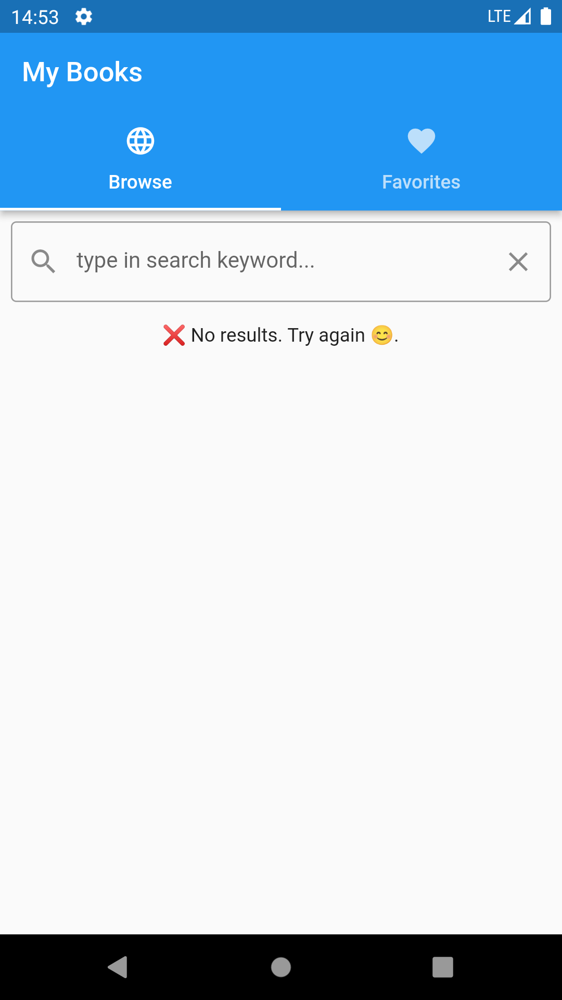
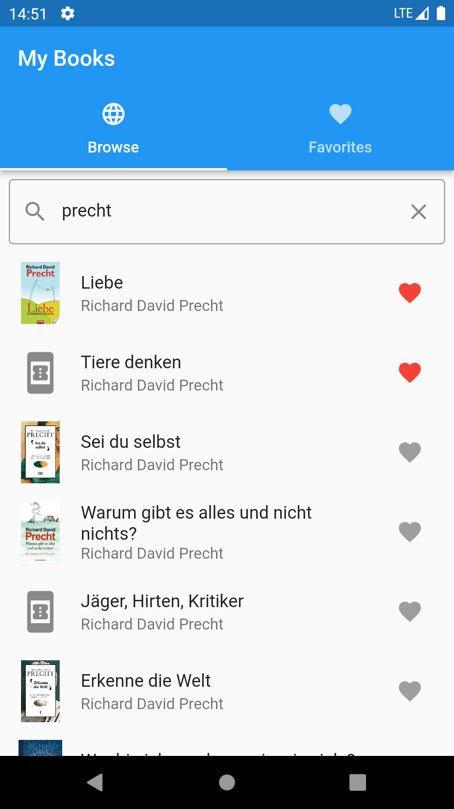
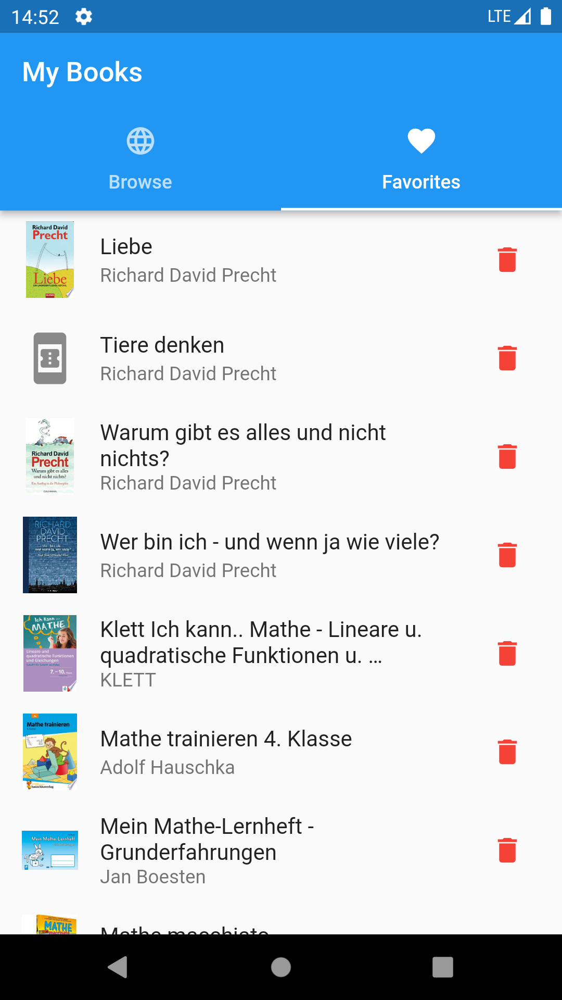

<h1>Introduction</h1>
Liebe Community, 
 
mit dieser einfachen App kann der User Bücher über die Google Books API suchen und offline als Favoriten speichern.
 
<h1>Features</h1>

- Suchen mit einfachem Keyword
- Anzeige von aktuellem Status mithilfe des BLOC Patterns (Loading, Results, Failure)
- Anzeige von Bildern (wenn vorhanden)
- Buch als Favorit hinzufügen/entfernen und auf lokaler Datenbank speichern (objectbox)
- Anzeige von mehr Details (wenn vorhanden: großes Bild, Subtitle und Buchbeschreibung) durch Klick auf Listenelement
- Anzeige von Favoriten unter zweitem Tab "Favorites"
- Sukzessives Laden der Ergenisse in 10er Schritten beim Scrollen nach unten (Pagination)
- Search history
- Ein paar Test Cases
<h1>ToDo</h1>

- Detaillierte Suche nach Authoren, Titel usw.
- Bilder der Favoriten in einen Cache laden
- No Internet Connection Handeling
- Sortierfunktionen
- Mehr Details zum Buch integrieren
- Mehr Test Cases
<h1>Installation</h1>
Da für die Speicherung der lokalen Daten <strong>objectbox</strong> verwendet wird und ich keinen Mac besitze, müssen für die Installation unter iOS noch kleine Änderungen vorgenommen werden. Hierfür wird XCode benötigt. Nähere Informationen im <a href="https://pub.dev/packages/objectbox" title="Readme von Objectbox">Readme von Objectbox</a>.
<h1>Screenshots</h1>

  
   
  

  
   

<h1>Licence</h1>
  
Creative Commons Lizenzvertrag 
Dieses Werk ist lizenziert unter einer Creative Commons Namensnennung-Nicht kommerziell 3.0 Deutschland Lizenz. 
 
